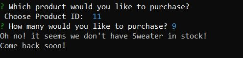
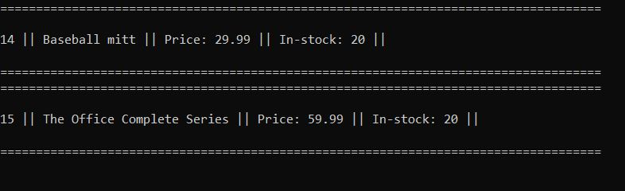

# Node.js-MySQL-Bamazon
an Amazon-like storefront, "Bamazon", application with the MySQL skills. The app will take in orders from customers and update/deplete stock from the store's inventory.

## Bamazon provides these levels:
* Customer View (bamazonCustomer.js)
* Manager View (bamazonManager.js)

## Technologies Used:

1. Node.js
2. Javascript
3. MySQL
4. NPM packages

## npm packages:

* dotenv
* inquirer
* mysql

## How to run Bamazon:

### Bamazon Customer View

1. With the Customer view, the program brings up the list of products, and prompts the user to choose an item with its product id.

2. Once the user inputs a number thats on the list, it takes the input, and runs it through the database. It calculates the quantity, that the user also inputs, with the price of the product.  The total cost, product name, amount, and a randomly generated invoice in displayed after the prompt.

* *Lastly*, it will update the database.

* if the user orders **too much**, or there is **not enough stock quantity**, they will receive an error message.

### Bamazon Manager View

1. With the Manager view, the program will bring up a menu list for the user to choose. The user will have the option to view products for sale, view low inventory, add to inventory, and add a new product.

2. Here the user views the products when choosing the option, *View Products for Sale*. 

3. When the user chooses, *View Low Inventory*, it will display the products with a low quantity of 5 and below.

4. Users may also choose to add more stock to any products in the inventory. *Add to Inventory*

5. The *Add New Product* option will allow the user to add a product to the database via terminal.

